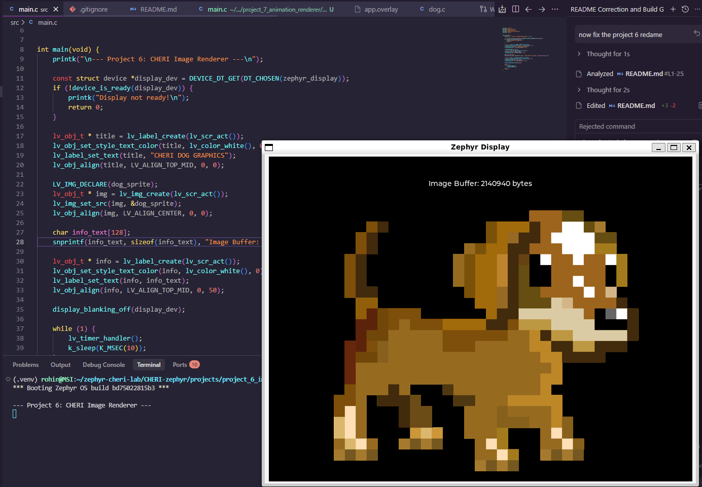

# Project 6: Dynamic Asset Isolation & Capability Management (RISC-V)

This project demonstrates the secure management of dynamic graphical assets—represented by a "Dog" sprite—on the **Zephyr RTOS** using **CHERI-RISC-V** hardware.

## 📸 System Implementation

*Figure 1: The animated dog asset rendered within a hardware-bounded memory region.*

## 🛡️ Security Features: Asset Integrity
* **Object-Level Isolation:** The dog asset is stored as a discrete memory object. CHERI capabilities ensure that any routine accessing the dog's pixel data cannot overread into adjacent kernel memory or other assets.
* **Pointer Revocation Safety:** The architecture ensures that if the asset is moved or reallocated, any old "stale" pointers (capabilities) are rendered invalid by the hardware, preventing use-after-free exploits.
* **Hardware Tagging:** Every pointer to the asset's metadata is tagged. If a malicious process attempts to modify the dog's position or size by bit-flipping the pointer, the hardware clears the "Tag Bit" and faults.


## 🛠️ Technical Stack
* **OS:** Zephyr RTOS
* **Graphics:** LVGL v9
* **Compiler:** CHERI-LLVM (Purecap)
* **Architecture:** RISC-V 64-bit with CHERI

## 🚀 Build and Run
```bash
west build -b qemu_riscv64cheri_purecap projects/project_6_image_renderer
west build -t run
```